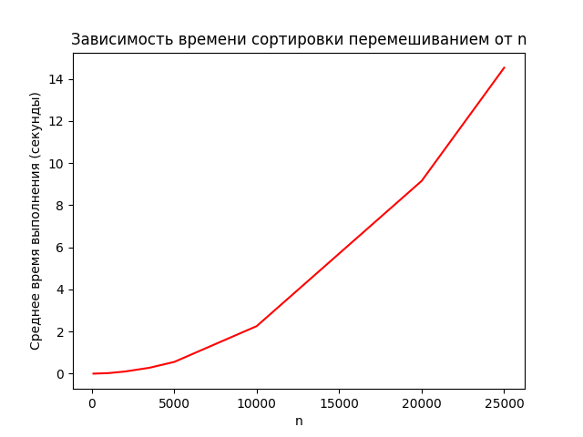

# Отчет (Овсяников АА)

## Алгоритмы сортировки

<h4> Цель работы: </h4>
Изучение основных алгоритмов на сортировки.


<h4> Постановка задачи: </h4>

1. Провести классификацию алгоритмов сортировки.
2. Подготовить теоретическое описание алгоритмов сортировки согласно номеру индивидуального варианта.
3. Подготовить блок-схему алгоритмов.
4. Представить описание алгоритмов на псевдокоде.
5. Описать достоинства и недостатки каждого алгоритма.
6. Реализовать алгоритмы сортировки согласно номеру индивидуального варианта.
7. Протестировать корректность реализации алгоритма
8. Провести ручную трассировку алгоритма.
9. Провести сравнение указанных алгоритмов сортировки массивов, содержащих n1, n2, n3 и n4 элементов.
10. Каждую функцию сортировки вызывать трижды: для сортировки упорядоченного массива, массива, упорядоченного в обратном порядке и неупорядоченного массива. Сортируемая последовательность для всех методов должна быть одинаковой (сортировать копии одного массива).
11. Проиллюстрировать эффективность алгоритмов сортировок по заданному критерию. Построить диаграммы указанных зависимостей.

### Классификация алгоритмов сортировки:


## Схемы алгоритмов:
### Поразрядная сортировка (Radix Sort):
1. Инициализация:

Находим максимальное число в массиве и устанавливаем начальное значение exp равным 1.
2. Внешний цикл: Пока max_num // exp больше 0, выполняем внутренний цикл:

3. Внутренний цикл (Counting Sort):

Создаем массив count и массив output.
Считаем количество элементов с одинаковыми разрядами и сохраняем в массив count.
Модифицируем массив count, чтобы он содержал конечные позиции элементов для каждого разряда.
Используем массив count для упорядочивания элементов в массиве output.
Копируем отсортированный массив из output в оригинальный массив.
 Увеличиваем значение exp в 10 раз.
Окончание: Массив отсортирован.

### Сортировка перемешиванием (Shaker Sort):
Инициализация: Устанавливаем флаг swapped в True, начальные значения start и end на края массива.

Внешний цикл: Пока swapped равно True и start меньше end, выполняем внутренний цикл:

1. Проход слева направо:
Перебираем элементы массива. Если текущий элемент больше следующего, меняем их местами и устанавливаем флаг swapped в True.
2. Если swapped равно False, завершаем сортировку.
3. Проход справа налево:
Перебираем элементы массива в обратном порядке. Если текущий элемент больше предыдущего, меняем их местами и устанавливаем флаг swapped в True.
4. Уменьшаем значение end.
5. Если swapped равно False, завершаем сортировку.
6. Увеличиваем значение start.

Окончание: Массив отсортирован.


## Описание алгоритмов на псевдокоде:
### Поразрядная сортировка 
```procedure counting_sort(arr, exp):
    n = length(arr)
    output = array of size n
    count = array of size 10

    for i from 0 to 9:
        count[i] = 0

    for i from 0 to n-1:
        index = arr[i] // exp % 10
        count[index] += 1

    for i from 1 to 9:
        count[i] += count[i-1]

    for i from n-1 downto 0:
        index = arr[i] // exp % 10
        output[count[index] - 1] = arr[i]
        count[index] -= 1

    for i from 0 to n-1:
        arr[i] = output[i]

procedure radix_sort(arr):
    max_num = max(arr)
    exp = 1

    while max_num // exp > 0:
        counting_sort(arr, exp)
        exp *= 10
```

### Сортировка перемешиванием:
```procedure shaker_sort(arr):
    n = length(arr)
    swapped = true
    start = 0
    end = n - 1

    while swapped and start < end:
        swapped = false

        for i from start to end:
            if arr[i] > arr[i+1]:
                swap(arr[i], arr[i+1])
                swapped = true

        if not swapped:
            break

        swapped = false
        end -= 1

        for i from end-1 downto start:
            if arr[i] > arr[i+1]:
                swap(arr[i], arr[i+1])
                swapped = true

        start += 1
```


# Преимущества и недостатки алгоритмов:

### Поразрядная сортировка (Radix Sort):

#### Достоинства:
1. **Стабильность:** Поразрядная сортировка является стабильным алгоритмом, что означает сохранение относительного порядка равных элементов.
2. **Применимость к числовым данным:** Эффективно сортирует числовые данные и строки, представленные в виде чисел (например, целые числа).
3. **Отсутствие сравнений:** Не требует сравнений между элементами массива, что может быть выигрышем в случае больших объемов данных.

#### Недостатки:
1. **Неприменимость к некоторым данным:** Не подходит для сортировки данных, не представленных в числовой форме (например, строки произвольной длины).
2. **Дополнительная память:** Может потребовать дополнительной памяти для создания вспомогательных структур данных (например, массивов для подсчета).
3. **Жесткое ограничение на формат данных:** Требует, чтобы сортируемые элементы имели фиксированную длину.

### Сортировка перемешиванием (Shaker Sort):

#### Достоинства:
1. **Простота реализации:** Легко понимается и реализуется, не требует сложных конструкций.
2. **Адаптивность:** Алгоритм может быть адаптирован для случая, когда массив уже частично отсортирован.

#### Недостатки:
1. **Низкая эффективность:** В среднем имеет квадратичную сложность, что делает его менее эффективным для больших объемов данных.
2. **Ограниченная применимость:** Подходит для небольших массивов данных, но не является оптимальным для крупных наборов.
3. **Неустойчивость:** Не гарантирует стабильность сортировки, то есть может изменить относительный порядок равных элементов.


### Поразрядная сортировка (Radix Sort):

Предположим, у нас есть массив: `arr = [170, 45, 75, 90, 802, 24, 2, 66]`.

1. **Первая итерация: exp = 1**
   - counting_sort(arr, 1):
     - Создаем массив count: `[0, 2, 1, 1, 1, 0, 1, 1, 1, 0]` (разряды единиц).
     - Изменяем count: `[0, 2, 3, 4, 5, 5, 6, 7, 8, 8]`.
     - Создаем отсортированный массив output: `[170, 90, 802, 2, 24, 45, 75, 66]`.
     - Обновляем arr: `[170, 90, 802, 2, 24, 45, 75, 66]`.

2. **Вторая итерация: exp = 10**
   - counting_sort(arr, 10):
     - Создаем массив count: `[0, 1, 1, 0, 2, 2, 1, 0, 0, 1]` (разряды десятков).
     - Изменяем count: `[0, 1, 2, 2, 4, 6, 7, 7, 7, 8]`.
     - Создаем отсортированный массив output: `[2, 24, 45, 66, 170, 75, 802, 90]`.
     - Обновляем arr: `[2, 24, 45, 66, 170, 75, 802, 90]`.

3. **Третья итерация: exp = 100**
   - counting_sort(arr, 100):
     - Создаем массив count: `[5, 3, 1, 1, 0, 0, 0, 0, 0, 1]` (разряды сотен).
     - Изменяем count: `[5, 8, 9, 10, 10, 10, 10, 10, 10, 11]`.
     - Создаем отсортированный массив output: `[2, 24, 45, 66, 75, 90, 170, 802]`.
     - Обновляем arr: `[2, 24, 45, 66, 75, 90, 170, 802]`.

Таким образом, мы получаем отсортированный массив `[2, 24, 45, 66, 75, 90, 170, 802]`.

### Сортировка перемешиванием (Shaker Sort):

Предположим, у нас есть массив: `arr = [64, 34, 25, 12, 22, 11, 90]`.

1. **Первая итерация:**
   - Проход справа налево: `[64, 34, 25, 12, 22, 11, 90]`.
   - Обмен: `[64, 34, 25, 12, 22, 11, 90]` (больший элемент идет вправо).
   - Проход слева направо: `[34, 25, 12, 22, 11, 64, 90]`.
   - Обмен: `[34, 25, 12, 22, 11, 64, 90]` (меньший элемент идет влево).
   - Проход справа налево: `[25, 12, 22, 11, 34, 64, 90]`.
   - Обмен: `[25, 12, 22, 11, 34, 64, 90]`.
   - Проход слева направо: `[12, 22, 11, 25, 34, 64, 90]`.
   - Обмен: `[12, 22, 11, 25, 34, 64, 90]`.

2. **Вторая итерация:**
   - Проход справа налево: `[12, 22, 11, 25, 34, 64, 90]`.
   - Обмен: `[12, 22, 11, 25, 34, 64, 90]`.
   - Проход слева направо: `[12, 22, 11, 25, 34, 64, 90]`.
   - Обмен: `[12, 22, 11, 25, 34, 64, 90]`.
   - Проход справа налево: `[11, 12, 22, 25, 34, 64, 90]`.
   - Обмен: `[11, 12, 22, 25, 34, 64, 90]`.

Таким образом, мы получаем отсортированный массив `[11, 12, 22, 25, 34, 64, 90]`.


## Реализация альгоритмов на PYTHON:

### Поразрядная сортировка (Radix Sort):

Поразрядная сортировка работает путем сортировки элементов массива по разрядам. Начиная с младшего разряда и двигаясь к старшему, элементы группируются по значению каждого разряда.

```def radix_sort(arr):
    def counting_sort(arr, exp):
        n = len(arr)
        output = [0] * n
        count = [0] * 10

        for i in range(n):
            index = arr[i] // exp
            count[index % 10] += 1

        for i in range(1, 10):
            count[i] += count[i - 1]

        i = n - 1
        while i >= 0:
            index = arr[i] // exp
            output[count[index % 10] - 1] = arr[i]
            count[index % 10] -= 1
            i -= 1

        i = 0
        for i in range(n):
            arr[i] = output[i]

    max_num = max(arr)
    exp = 1
    while max_num // exp > 0:
        counting_sort(arr, exp)
        exp *= 10
```

### Пояснения:

1. Подготовка массива к сортировке:

Находим максимальный элемент в массиве, чтобы определить количество цифр в нем.
Инициализируем переменную exp равной 1. Она представляет текущий разряд, с которого мы начинаем.
2. Cортировка (counting sort) для каждого разряда:

Создаем массив count размером 10 (по количеству цифр от 0 до 9).
Проходим по массиву и увеличиваем соответствующий элемент count для каждой цифры.
Модифицируем count так, чтобы каждый элемент count[i] указывал на количество элементов с разрядом i или меньше.
Создаем выходной массив output той же длины, что и входной.

3. Построение отсортированного массива:

Проходим по входному массиву в обратном порядке и для каждого элемента:
Находим его разряд, деля его на текущую переменную exp.
Используем информацию из массива count для определения правильной позиции элемента в выходном массиве.
Уменьшаем count для текущего разряда.
Помещаем элемент на найденную позицию в output.

4. Обновление разряда и повторение:

Умножаем exp на 10 для перехода к следующему разряду.
Повторяем шаги 2-3 для нового разряда.
Продолжаем этот процесс до тех пор, пока не обработаем все разряды.
Возвращение отсортированного массива:

В итоге у нас получается отсортированный массив.


## Сортировка перемешиванием (Shaker Sort):

Сортировка перемешиванием (или Shaker Sort) является вариантом пузырьковой сортировки. Основная идея - двигаться вперед и назад через список, сравнивая и обменивая соседние элементы до тех пор, пока не будет достигнут конечный результат.

```def shaker_sort(arr):
    n = len(arr)
    swapped = True
    start = 0
    end = n - 1
    while swapped:
        swapped = False
        for i in range(start, end):
            if arr[i] > arr[i + 1]:
                arr[i], arr[i + 1] = arr[i + 1], arr[i]
                swapped = True
        if not swapped:
            break
        swapped = False
        end -= 1
        for i in range(end - 1, start - 1, -1):
            if arr[i] > arr[i + 1]:
                arr[i], arr[i + 1] = arr[i + 1], arr[i]
                swapped = True
        start += 1
```

### Пояснения:
Устанавливаем начальные значения: swapped - флаг, указывающий, был ли произведен обмен на текущей итерации; start и end - границы текущего подсписка.

Пока есть возможность для обмена (swapped == True):
1. Проходим слева направо по подсписку (start до end), сравнивая и обменивая соседние элементы при необходимости.
2. Если был хотя бы один обмен, обновляем swapped.
3. Уменьшаем end, так как самый большой элемент уже находится на своем месте.
4. Проходим справа налево по подсписку (end до start), сравнивая и обменивая соседние элементы при необходимости.
5. Если был хотя бы один обмен, обновляем swapped.
6. Увеличиваем start, так как самый маленький элемент уже находится на своем месте.

Алгоритм завершается, когда не происходит ни одного обмена, что означает, что список отсортирован.


### Временная сложность алгоритмов:

1. **Поразрядная сортировка (Radix Sort):**
   - В среднем и в худшем случае O(n)
   - Временная сложность поразрядной сортировки составляет O(d * (n + k)), где d - количество разрядов в максимальном числе, n - количество элементов в массиве, k - основание системы счисления (в данном случае, 10).

2. **Сортировка перемешиванием (Shaker Sort):**
   - В среднем и в худшем случае временная сложность сортировки перемешиванием составляет O(n^2), где n - количество элементов в массиве.





### Контрольный вопросы:

1. **Суть метода сортировки вставками:**
   - Метод сортировки вставками заключается в поочередном включении каждого элемента массива в уже упорядоченную часть массива.

2. **Шаги алгоритма сортировки вставками:**
   - Выбирается элемент из неотсортированной части массива.
   - Этот элемент вставляется в правильную позицию в отсортированной части массива.

3. **Программная реализация сортировки вставками:**
   ```python
   def insertion_sort(arr):
       for i in range(1, len(arr)):
           key = arr[i]
           j = i - 1
           while j >= 0 and key < arr[j]:
               arr[j + 1] = arr[j]
               j -= 1
           arr[j + 1] = key
   ```

4. **Достоинства и недостатки сортировки вставками:**
   - *Достоинства:* Проста в реализации, эффективна для небольших массивов.
   - *Недостатки:* Неэффективна для больших массивов из-за квадратичной сложности.

5. **Пример сортировки методом вставок:**
   - Пусть есть массив `[5, 2, 4, 3, 1]`, после сортировки вставками он станет `[1, 2, 3, 4, 5]`.

6. **Суть сортировки методом Шелла:**
   - Сортировка Шелла представляет собой усовершенствованный метод сортировки вставками с изменяемым интервалом.

7. **Преимущества метода Шелла:**
   - Лучшие показатели по сравнению с простыми методами благодаря уменьшению количества перестановок элементов.

8. **Пример сортировки методом Шелла:**
   - Пусть есть массив `[5, 2, 4, 3, 1]`, после сортировки Шелла он может стать, например, `[1, 2, 3, 4, 5]`.

9. **Фактор, влияющий на эффективность метода Шелла:**
   - Выбор последовательности шагов группировки, которая уменьшает количество элементов, с которыми нужно сравнивать каждый элемент.

10. **Рекомендуемая последовательность шагов для Шелла:**
    - Рекомендуется использовать последовательность Шелла: `n / 2, n / 4, ..., 1`.

11. **Программная реализация сортировки Шелла:**
    ```python
    def shell_sort(arr):
        n = len(arr)
        gap = n // 2
        while gap > 0:
            for i in range(gap, n):
                temp = arr[i]
                j = i
                while j >= gap and arr[j - gap] > temp:
                    arr[j] = arr[j - gap]
                    j -= gap
                arr[j] = temp
            gap //= 2
    ```

12. **Суть метода сортировки выбором:**
    - Метод сортировки выбором заключается в нахождении минимального элемента массива и помещении его в начало, затем нахождении следующего минимального и помещении его после первого элемента.

13. **Шаги алгоритма сортировки выбором:**
    - Ищется минимальный элемент в неотсортированной части массива и меняется местами с первым элементом неотсортированной части.

14. **Программная реализация сортировки выбором:**
    ```python
    def selection_sort(arr):
        for i in range(len(arr)):
            min_index = i
            for j in range(i + 1, len(arr)):
                if arr[j] < arr[min_index]:
                    min_index = j
            arr[i], arr[min_index] = arr[min_index], arr[i]
    ```

15. **Достоинства и недостатки сортировки выбором:**
    - *Достоинства:* Проста в реализации, эффективна для небольших массивов.
    - *Недостатки:* Квадратичная сложность, много перестанов

ок.

16. **Пример сортировки методом выбора:**
    - Пусть есть массив `[5, 2, 4, 3, 1]`, после сортировки выбором он станет `[1, 2, 3, 4, 5]`.

17. **Суть метода сортировки обменом:**
    - Сортировка обменом заключается в поочередном обмене соседних элементов, если они находятся в неправильном порядке.

18. **Шаги алгоритма сортировки обменом:**
    - Проход по массиву, сравнение соседних элементов, их обмен, повторение процесса до полной сортировки.

19. **Программная реализация сортировки обменом:**
    ```python
    def bubble_sort(arr):
        n = len(arr)
        for i in range(n):
            for j in range(0, n - i - 1):
                if arr[j] > arr[j + 1]:
                    arr[j], arr[j + 1] = arr[j + 1], arr[j]
    ```

20. **Достоинства и недостатки сортировки обменом:**
    - *Достоинства:* Проста в реализации.
    - *Недостатки:* Квадратичная сложность, много перестановок.

21. **Пример сортировки методом обмена:**
    - Пусть есть массив `[5, 2, 4, 3, 1]`, после сортировки обменом он станет `[1, 2, 3, 4, 5]`.

22. **Суть метода быстрой сортировки:**
    - Быстрая сортировка использует метод "разделяй и властвуй", разбивая массив на подмассивы, сортируя их и объединяя.

23. **Преимущества быстрой сортировки:**
    - Быстрая сортировка обычно эффективна из-за использования стратегии "разделяй и властвуй", особенно для больших массивов.

24. **Опорный элемент в быстрой сортировке:**
    - Опорный элемент выбирается так, чтобы элементы, меньшие опорного, оказывались слева, а большие - справа.

25. **Пример быстрой сортировки массива:**
    - Пусть есть массив `[5, 2, 4, 3, 1]`, после быстрой сортировки он станет `[1, 2, 3, 4, 5]`.

26. **Применимость быстрой сортировки:**
    - Применима для средних и больших массивов, эффективна на практике.

27. **Фактор, влияющий на эффективность быстрой сортировки:**
    - Выбор опорного элемента и его позиция.

28. **Выбор серединного элемента в быстрой сортировке:**
    - Может привести к плохим результатам, если массив частично упорядочен или имеет специфическую структуру.

29. **Наилучшее правило выбора опорного элемента:**
    - Наилучшее правило - использовать случайный элемент, чтобы избежать худшего случая.

30. **Простое правило выбора опорного элемента:**
    - Использовать первый элемент массива.

31. **Усовершенствования быстрой сортировки:**
    - Медиана трех, оптимизации для малых массивов, использование гибридных методов.

32. **Почему быстрая сортировка проще всего программно реализуется с помощью рекурсии?**
   - Рекурсивная структура алгоритма быстрой сортировки отражает естественное разбиение задачи на подзадачи: выбор опорного элемента, разделение массива на две части и рекурсивная сортировка каждой из них.

33. **Как программно реализуется рекурсивный вариант метода быстрой сортировки?**
   - Выбирается опорный элемент, разбивается массив на две части (меньше и больше опорного), затем рекурсивно сортируются каждая из этих частей.

34. **Какие особенности имеет не рекурсивная программная реализация метода быстрой сортировки?**
   - Не рекурсивная реализация обычно использует стек или явным образом управляет порядком обработки подзадач. Она требует явного хранения и обновления стека вызовов.

35. **В чем состоит суть метода пирамидальной сортировки?**
   - Метод пирамидальной сортировки основан на пирамидальной структуре данных (пирамиде). Сначала строится пирамида, затем извлекается максимальный элемент, и процесс повторяется до полной сортировки.

36. **Какой набор данных имеет пирамидальную организацию?**
   - Массив данных считается пирамидально организованным, когда он удовлетворяет свойствам пирамиды: каждый элемент больше (меньше) своих потомков.

37. **Чем отличаются друг от друга дерево поиска и пирамидальное дерево?**
   - Дерево поиска удовлетворяет свойствам поиска (левый потомок меньше, правый больше), в то время как пирамидальное дерево устроено так, чтобы самый большой элемент находился в корне (для макс-пирамиды).

38. **Приведите пример пирамидального дерева с целочисленными ключами.**
   - Пример: `[90, 84, 78, 67, 50, 42, 38, 32, 22, 10]` (макс-пирамида).

39. **Какие полезные свойства имеет пирамидальное дерево?**
   - Эффективность извлечения максимального (минимального) элемента и возможность быстрого добавления новых элементов.

40. **Какие шаги выполняются при построении пирамидального дерева?**
   - Построение начинается с последнего уровня дерева и идет вверх, при этом каждый узел просеивается вниз до тех пор, пока выполняется условие пирамидальности.

41. **Что такое просеивание элемента через пирамиду?**
   - Процесс обновления пирамидальной структуры, начиная с добавленного или измененного элемента, чтобы восстановить свойство пирамиды.

42. **Приведите практический пример построения пирамидального дерева.**
   - Добавление элементов поочередно: 10, 22, 32, 38, 42, 50, 67, 78, 84, 90, с последующим просеиванием.

43. **Какие шаги выполняются на втором этапе пирамидальной сортировки?**
   - Первый элемент массива (максимальный) меняется с последним, затем пирамида уменьшается на 1 элемент, и производится просеивание корня.

44. **Приведите практический пример реализации второго этапа пирамидальной сортировки.**
   - Обмен максимального и последнего элемента, последующее просеивание уменьшенной пирамиды.

45. **Что можно сказать о трудоемкости метода пирамидальной сортировки?**
   - Трудоемкость пирамидальной сортировки составляет O(n log n), что делает ее эффективной для сортировки больших объемов данных.